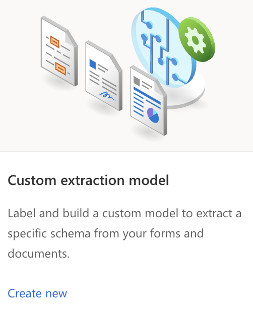
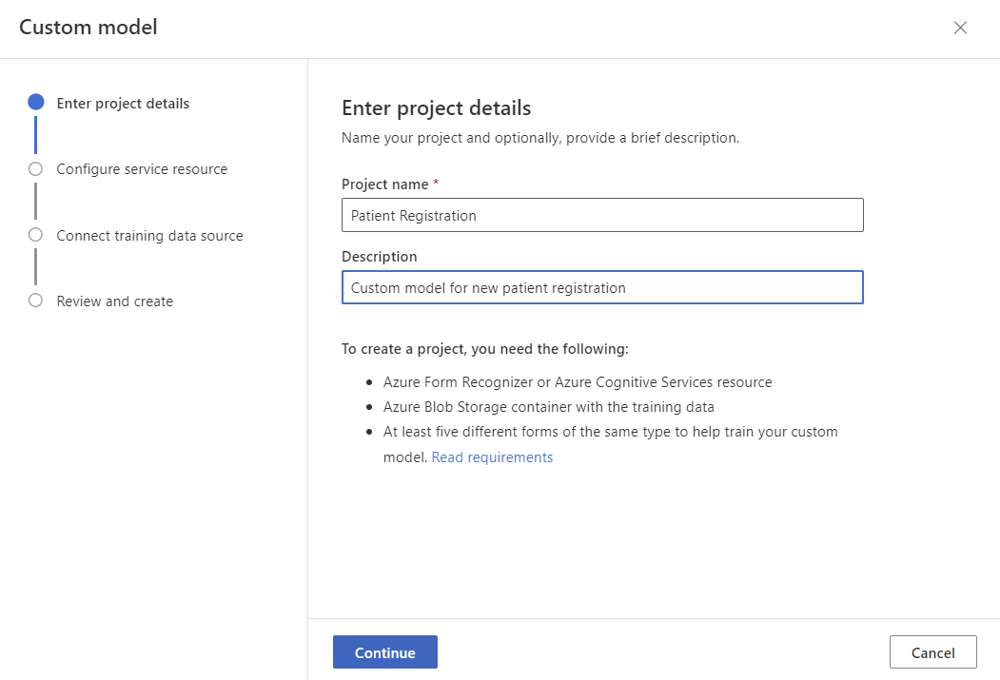
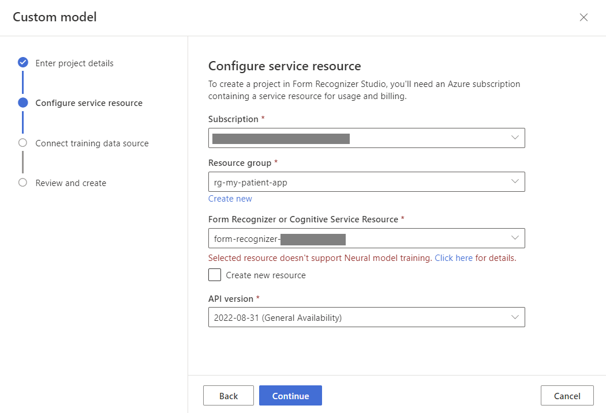
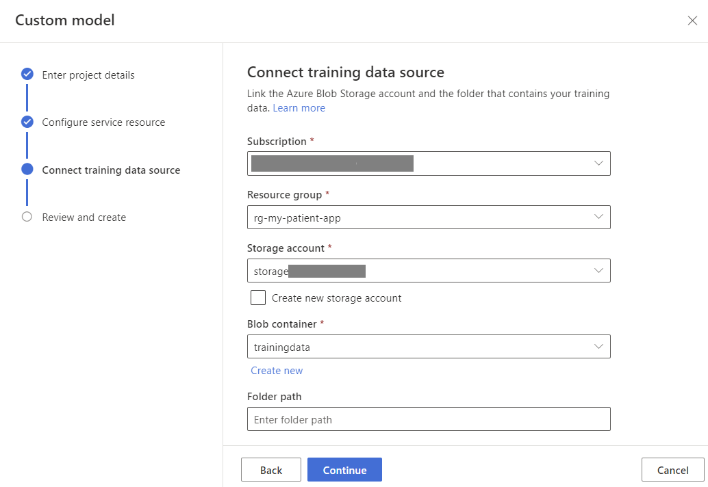
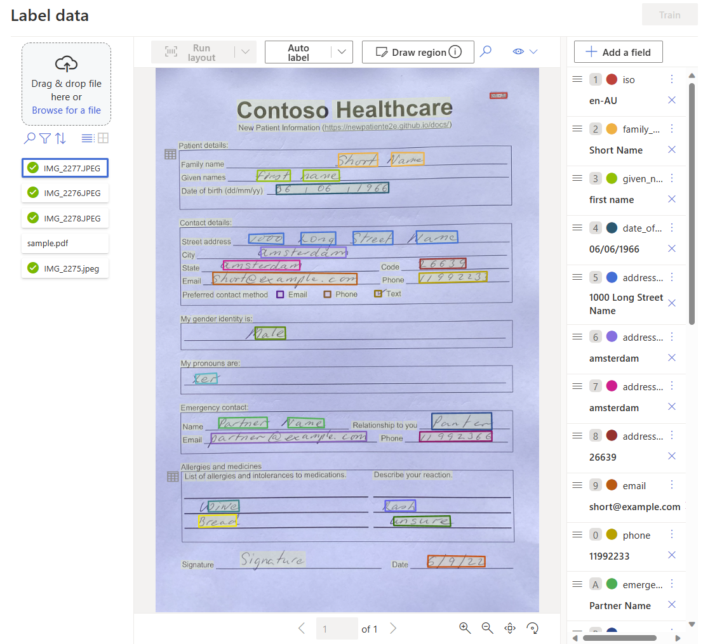

# Create a project

The Form Recognizer Studio provides and orchestrates all the API calls required to complete your dataset and train your model.

1. Start by navigating to [Form Recognizer Studio](https://formrecognizer.appliedai.azure.com/studio).

1. Select the **Custom models** tile, on the custom models page.

    

1. Next, select the **Create a project** button.

1. On the create project dialog, provide a
    1. Name for your project,
    2. Optionally a description,
    3. Select **Continue**.

    

2. On the next page, complete the following steps:

    1. Select your Azure subscription.
    2. Select the resource group whose name starts with **rg-contoso-health-app-NNNNNN**.
    3. Select the Form Recognizer service Resource.
    4. Select API version **2022-08-31 (General Availability)**.
    5. Select **Continue**.

    

3. Next, select the storage account where you uploaded your custom model training dataset.

    1. Select your Azure subscription.
    2. Select the resource group **rg-contoso-health-app-NNNNNN**.
    3. Select the storage account, there should be only one storage account in this resource group.
    4. Select the **trainingdata** blob container.
    5. Leave the **Folder path** field empty.
    6. Select **Continue**.
    7. Select **Create project**.

    

The form recognizer service will now be created and configured. Once the service is created, the Studio will open the project and display the **Label data** page along with the first pre-labeled document. 

Close the **Upload a document** dialogue as you have already uploaded the documents to the Azure Storage account used by this Form Recognizer project.

