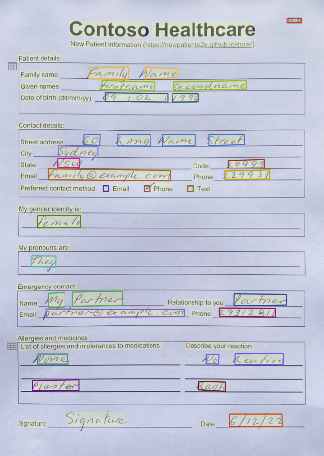
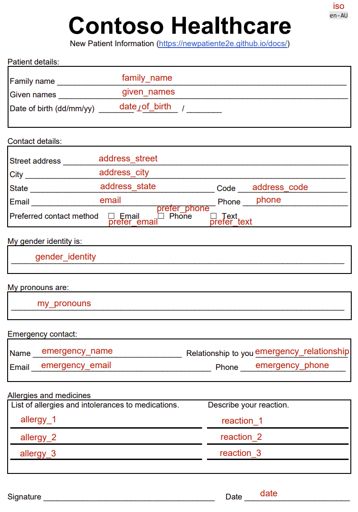
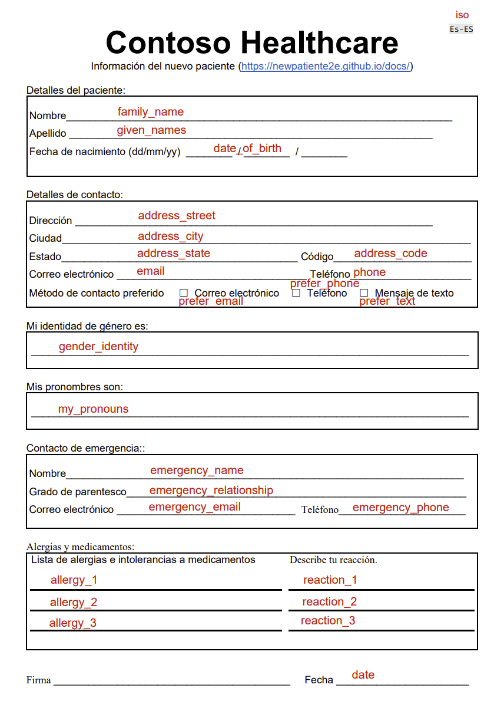
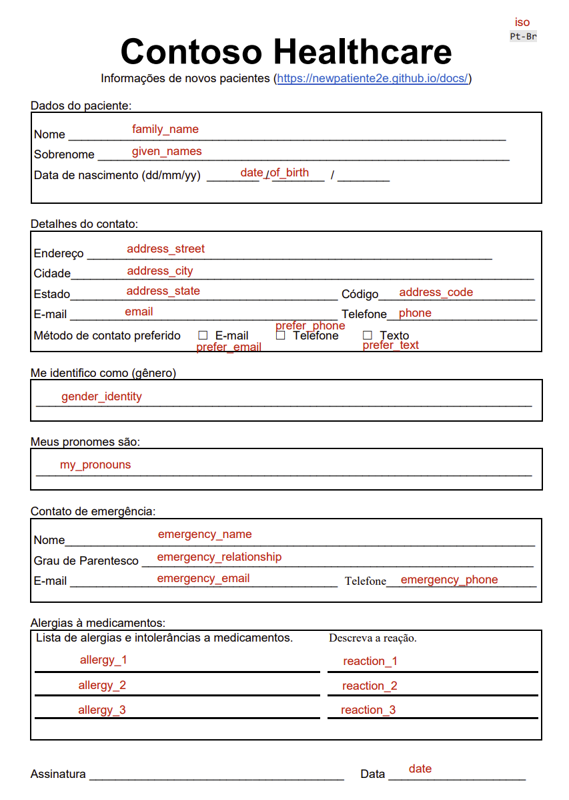

# Label your data

In your project, there are five documents, four of the documents have a green dot to indicate the documents have been analyzed and labeled. The fifth document needs to be analyzed and labeled.

## Video introduction to labeling forms with Azure AI Document Intelligence

Watch this YouTube to understand how to label an English language version of a form. Open the video on Youtube to watch in full screen.

<iframe width="800" height="450" src="https://www.youtube.com/embed/d1QHX47mSDo" title="YouTube video player" frameborder="0" allow="accelerometer; autoplay; clipboard-write; encrypted-media; gyroscope; picture-in-picture" allowfullscreen></iframe>

<!-- ## New patient registration form

Select the document named **sample.pdf**. The document is the last in the list of documents on the **Label data** page.

 -->

## Label the new patient registration form

The following steps will show you how to label your data.

<!-- The document language will match the folder of documents you uploaded to your Azure Storage Account. For example, if you uploaded the English folder, the document language will be English. -->

1. Select the document named _sample.pdf_. 
2. Select `Run layout` the document will analyze and then open the document for labeling.
3. Select the ISO language code for the document. You'll find this field in the top right-hand corner of the document, then from the list of labels, select **iso**.
4. Now repeat this labeling process for all the fields in the document. See the tables below for the list of form fields and their associated labels for:

    - [English Labels](#english-labels),
    - [Etiquetas Españolas](#etiquetas-españolas),
    - [Etiquetas Portuguêsas ](#etiquetas-portuguêsas), and
    - [普通话标签](#普通话标签).

:::note

You can filter the list of labels by typing the label name in the list of labels dropdown. For example, if you type `family` in the list of labels, the `family_name` label will be displayed.

:::

<!-- The following tables show the labels that are available for the new patient registration form for the following languages:

- [English Labels](#english-labels)
- [Etiquetas Espanholas](#etiquetas-espanholas)
- [Etiquetas Portuguêsas ](#etiquetas-portuguêsas)
- [普通话标签](#普通话标签) -->

## English Labels

1. Select the Family name field on the analyzed document, then from the list of labels, select `family_name`.
1. Repeat this process for the remaining fields in the document. It's important to correctly label all the fields in the document as they will be used to train the model.

    |  Document element | Label name  |
    |---|---|
    | Document language iso | iso  |
    | Family name  | family_name  |
    | Given names  | given_names  |
    | Date of birth             | date_of_birth |
    | Street address | address_street |
    | City|  address_city |
    | State | address_state |
    | Code | address_code |
    | Email | email |
    | Phone | phone |
    | Prefer Email checkbox | prefer_email |
    | Prefer Phone checkbox | prefer_phone |
    | Prefer Text checkbox | prefer_text |
    | My gender identity | gender_identity |
    | My pronouns | my_pronouns |
    | Emergency contact name | emergency_name |
    | Emergency contact relationship | emergency_relationship |
    | Emergency contact email | emergency_email |
    | Emergency contact phone | emergency_phone |
    | Allergy row 1 | allergy_1 |
    | Allergy row 2 | allergy_2 |
    | Allergy row 3 | allergy_3 |
    | Reaction row 1 | reaction_1 |
    | Reaction row 2 | reaction_2 |
    | Reaction row 3 | reaction_3 |
    | date | date |

You now have all the documents in your dataset labeled. If you look at the storage account, you'll find a _.labels.json_ and _.ocr.json_ files that correspond to each document in your training dataset and a new fields.json file. This training dataset will be submitted to train the model.

## Etiquetas Españolas

1. Seleccione el campo Nombre Completo en el documento analizado, luego de la lista de etiquetas, seleccione nombre_completo.

1. Repita este proceso para los campos restantes del documento. Es muy importante etiquetar correctamente todos los campos del documento, ya que se utilizarán para entrenar el modelo.

    |  Elemento de documento | Nombre de etiqueta  |
    |---|---|
    | Idioma del documento iso | iso  |
    | Nombre | family_name  |
    | Apellido | given_names  |
    | Fecha de nacimiento | date_of_birth |
    | Dirección | address_street |
    | Ciudad|  address_city |
    | Estado | address_state |
    | Código | address_code |
    | Correo electrónico | email |
    | Teléfono | phone |
    | Método de contacto preferido: Correo electrónico| prefer_email |
    | Método de contacto preferido: teléfono | prefer_phone |
    | Método de contacto preferido: Mensaje de texto | prefer_text |
    | Mi identidad de género es | gender_identity |
    | Mis pronombres son | my_pronouns |
    | Contacto de emergencia: Nombre | emergency_name |
    | Contacto de emergencia: Grado de parentesco | emergency_relationship |
    | Contacto de emergencia: Correo electrónico | emergency_email |
    | Contacto de emergencia: Teléfono | emergency_phone |
    | Alergia fila 1 | allergy_1 |
    | Alergia fila 2 | allergy_2 |
    | Alergia fila 3| allergy_3 |
    | Fila de reacción 1 | reaction_1 |
    | Fila de reacción 2 | reaction_2 |
    | Fila de reacción 3 | reaction_3 |
    | Fecha | date |

Ahora tiene todos los documentos en su conjunto de datos etiquetados. Si observa la cuenta de almacenamiento, encontrará archivos .labels.json y .ocr.json que corresponden a cada documento en su conjunto de datos de entrenamiento y un nuevo archivo fields.json. Este conjunto de datos de entrenamiento se enviará para entrenar el modelo.

## Etiquetas Portuguêsas

1. Selecione o campo Nome Completo no documento analisado e, na lista de rótulos, selecione nome_completo.
1. Repita este processo para os demais campos do documento. É importante rotular corretamente todos os campos no documento, pois eles serão usados para treinar o modelo.

    |  Elemento do documento | Nome do rótulo  |
    |---|---|
    | Idioma do documento iso | iso  |
    | Nome | family_name  |
    | Sobrenome  | given_names  |
    | Data de nascimento            | date_of_birth |
    | Endereço | address_street |
    | Cidade |  address_city |
    | Estada | address_state |
    | Código | address_code |
    | E-mail | email |
    | Telefone | Phone |
    | E-mail de preferência checkbox | prefer_email |
    | Telefone de preferência checkbox | prefer_phone |
    | Texto de preferência checkbox | prefer_text |
    | Me identifico como (gênero) | gender_identity |
    | Meus pronomes são: | my_pronouns |
    | Contato de emergência: Nome | emergency_name |
    | Contato de emergência: Grau de Parentesco  | emergency_relationship |
    | Contato de emergência: E-mail | emergency_email |
    | Contato de emergência: Telefone | emergency_phone |
    | Alergia linha 1 | allergy_1 |
    | Alergia linha 2 | allergy_2 |
    | Alergia linha 3 | allergy_3 |
    | Linha de reação 1 | reaction_1 |
    | Linha de reação 2 | reaction_2 |
    | Linha de reação 3 | reaction_3 |
    | Data| Date |

Agora você tem todos os documentos em seu conjunto de dados rotulados. Se você observar a conta de armazenamento, encontrará arquivos .labels.json e .ocr.json que correspondem a cada documento em seu conjunto de dados de treinamento e um novo arquivo fields.json. Este conjunto de dados de treinamento será enviado para treinar o modelo

<!-- ## 普通话标签

1. 选择分析文档上的姓氏字段，然后从标签列表中选择“family_name”。
1. 对文档中的其余字段重复此过程。 正确标记文档中的所有字段非常重要，因为它们将用于训练模型。

|  文档元素 | 标签名称  |
|---|---|
| 文档语言 iso | iso  |
| 姓  | family_name  |
| 姓  | given_names  |
| 出生日期             | date_of_birth |
| 街道地址 | address_street |
| 城市|  address_city |
| 状态 | address_state |
| 代码 | address_code |
| 电子邮件 | email |
| 电话 | phone |
| 首选电子邮件复选框 | prefer_email |
| 首选电话复选框| prefer_phone |
| 首选文本复选框 | prefer_text |
| 我的性别认同 | gender_identity |
| 我的代名词 | my_pronouns |
| 紧急联络名字 | emergency_name |
| 紧急联络关系 | emergency_relationship |
| 紧急联络电子邮件 | emergency_email |
| 紧急联络电话 | emergency_phone |
| 过敏第 1 行 | allergy_1 |
| 过敏第 2 行 | allergy_2 |
| 过敏第 3 行 | allergy_3 |
| 反应排 1 | reaction_1 |
| 反应第 2 行 | reaction_2 |
| 反应排 3 | reaction_3 |

您现在已标记数据集中的所有文档。 如果您查看存储帐户，您会发现与训练数据集中的每个文档相对应的 _.labels.json_ 和 _.ocr.json_ 文件以及一个新的 fields.json 文件。 此训练数据集将被提交以训练模型。 -->
