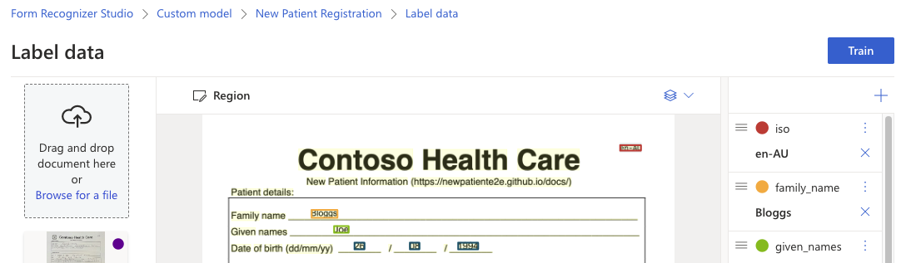

# Train your model

With your training forms labeled, you're now ready to train your model. Follow these steps to train your model.

1. Select the Train button in the upper-right corner.

    

1. From the train a new model dialog, name your model `patient-registration-model`, and optionally, provide a description.
1. Select **Template** from the **Build Mode**. 
    
    Template models train in a few minutes. Neural models can take up to 30 minutes to train. Learn more about [model types and capabilities](https://docs.microsoft.com/azure/applied-ai-services/form-recognizer/concept-custom?WT.mc_id=aiml-77396-cxa).

    

1. Select **Train** to initiate the training process. 
1. Select **Go to Models** to navigate to the *Models* menu to view the status of the train operation.
1. You may need to select `refresh` to see latest status of the train operation.

    :::note

    The training model status will change to **succeeded**. The model is now ready for use.

    :::

    

## Test the model

Once the model training is complete, you can test your model by selecting the model on the models list page.

1. Select **Test** from the Form Recognizer Studio menu.
1. Browse for a file or drag and drop a file into the *Test model* page. Select a .jpeg or .pdf file from the **contoso_new_patient_assets/training_labeled** folder that matches the language you used to train your model.
1. With a file selected, choose the **Analyze** button to test the model.
1. The model results are displayed in the main window and the fields extracted are listed in the right navigation bar on the *fields* tab.
1. Validate your model by evaluating the results for each field.
1. The right navigation bar also includes sample code to invoke your model and the JSON results from the API.

Congratulations you've trained a custom model in the Form Recognizer Studio! Your model is ready for use with the patient registration app.
