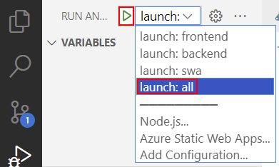

# Integrate Azure AI Document Intelligence

In this section, we're going to be updating an Azure Function to call Document Intelligence to extract the patient's information from the uploaded image.

## Updating the Azure Function

1. Switch back to VS Code, you should still have the **contoso_new_patient_app** open in VS Code.
1. Open the **UploadFile.cs** file, located at **src/api/NewPatient/UploadFile.cs**.
1. Scroll down to the **// TODO: Call Azure AI Document Intelligence** section.
1. Replace the **// TODO comment and throw** statement with the following code

    ```csharp
    string? endpoint = Environment.GetEnvironmentVariable("FORM_RECOGNIZER_ENDPOINT");
    string? apiKey = Environment.GetEnvironmentVariable("FORM_RECOGNIZER_API_KEY");
    string? modelId = Environment.GetEnvironmentVariable("FORM_RECOGNIZER_MODEL_ID");

    if (string.IsNullOrEmpty(endpoint) || string.IsNullOrEmpty(apiKey) || string.IsNullOrEmpty(modelId))
    {
        throw new InvalidOperationException("Missing environment variables");
    }

    var credential = new AzureKeyCredential(apiKey);
    var client = new DocumentAnalysisClient(new Uri(endpoint), credential);

    AnalyzeDocumentOperation operation = await client.AnalyzeDocumentAsync(WaitUntil.Completed, modelId, file.OpenReadStream());
    AnalyzeResult result = operation.Value;

    var outputs = new Dictionary<string, (string, float?)>();

    foreach (AnalyzedDocument document in result.Documents)
    {
        foreach ((string fieldName, DocumentField field) in document.Fields)
        {
            outputs.Add(fieldName, (field.Content, field.Confidence));
        }
    }

    return outputs;
    ```

1. You must **Save** the file.

<details>
<summary>What is this code doing?</summary>

Let's take some time to understand what this code is doing by breaking it down piece by piece.

```csharp
string? endpoint = Environment.GetEnvironmentVariable("FORM_RECOGNIZER_ENDPOINT");
string? apiKey = Environment.GetEnvironmentVariable("FORM_RECOGNIZER_API_KEY");
string? modelId = Environment.GetEnvironmentVariable("FORM_RECOGNIZER_MODEL_ID");

if (string.IsNullOrEmpty(endpoint) || string.IsNullOrEmpty(apiKey) || string.IsNullOrEmpty(modelId))
{
    throw new InvalidOperationException("Missing environment variables");
}
```

This first piece of code is retrieving the environment variables that contain the keys and other secret information for Azure AI Document Intelligence, avoiding us from hard-coding them into the code. We've also got some `null` checking, to ensure that we have set the values.

```csharp
var credential = new AzureKeyCredential(apiKey);
var client = new DocumentAnalysisClient(new Uri(endpoint), credential);
```

Here, we're creating the connection to Document Intelligence using the endpoint and API key.

```csharp
AnalyzeDocumentOperation operation = await client.AnalyzeDocumentAsync(WaitUntil.Completed, modelId, file.OpenReadStream());
AnalyzeResult result = operation.Value;

var outputs = new Dictionary<string, (string, float?)>();

foreach (AnalyzedDocument document in result.Documents)
{
    foreach ((string fieldName, DocumentField field) in document.Fields)
    {
        outputs.Add(fieldName, (field.Content, field.Confidence));
    }
}

return outputs;
```

Lastly, we'll call Azure AI Document Intelligence, telling it which image we want to analyze and what trained model to use for that. When the result comes back, we'll loop through the fields that were found and return them as a dictionary, which will later be stored in Cosmos DB.

</details>

<details>
<summary>Optional. Run the patient Static Web App locally.</summary>

## Running Locally

To run the application locally, we need to set the environment variables for the Azure Function in the **local.settings.json** file.

1. Create a new file (if one doesn't already exist) at **src/api/local.settings.json** and include the following code:

    ```json
    {
        "IsEncrypted": false,
        "Values": {
          "AzureWebJobsSecretStorageType": "files",
          "FUNCTIONS_WORKER_RUNTIME": "dotnet",          
          "COSMOS_DB": "REPLACE_WITH_COSMOS_DB_CONNECTION_STRING",
          "FORM_RECOGNIZER_API_KEY": "REPLACE_WITH_FORM_RECOGNIZER_API_KEY",
          "FORM_RECOGNIZER_ENDPOINT": "REPLACE_WITH_FORM_RECOGNIZER_ENDPOINT",
          "NEW_PATIENT_STORAGE": "REPLACE_WITH_STORAGE_CONNECTION_STRING",
          "FORM_RECOGNIZER_MODEL_ID": "patient-registration-model"
        },
        "Host": {
          "CORS": "*"
        }
    }
    ```

### List the Azure service keys

You will need the Azure service keys to configure the patient registration app. So, from the terminal window, run the following commands to list the Azure service keys.

1. Run the following command to list Azure service keys.

    ```bash
    azd env get-values
    ```

### Update the local.settings.json file

Replace the placeholders with the values from the `azd env get-values` command.

Once all the environment variables have been set, you can run the application locally.

### Run the application locally

1. Open the **Run and Debug** view from the VS Code sidebar, or select <kbd>Ctrl+Shift+D</kbd> or <kbd>Cmd+Shift+D</kbd> on macOS.

    

1. From the drop down, select **launch: all**, then select the _Start Debugging_ button.

    

    :::info

    Depending on how fast your computer is, it may take up to 30 seconds for the Static Web App to start.

    :::

1. Once all the debuggers have started, navigate to [http://localhost:4280](http://localhost:4280) in your web browser.

### Test the Application

1. Drag and drop one of the training images from the `contoso_new_patient_assets/training_labeled/<language>` folder into the drop zone. Be sure to use an image from the folder that matches the language you used to train the Document Intelligence model.
1. Next, select **Upload**.
1. Once the image has been uploaded, and after a few seconds, you'll see the fields that were extracted from the form.
1. Select **Save** to save the data to Patient Registration Cosmos DB.

    <!--  -->

</details>

## Deploy to Azure

Deploy the app to Azure Static Web Apps with the Azure Developer CLI.

1. From VS Code, select <kbd>Ctrl+Shift+`</kbd> to open a new terminal.
1. From the terminal, run the following command to start the function app. This command takes about one minute to deploy the updated function to Azure.

   ```bash
   azd deploy
   ```

## Open the patient registration app in your browser

1. From your browser, open the patient registration app at the **Web Service** URL displayed in the deployment logs.
   
   
2. Save the patient registration app URL for use in the next section.
