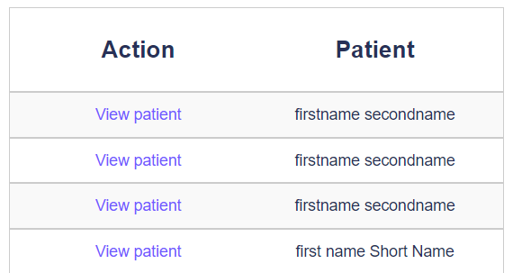

# Add surgery roles

## Create Static Web App roles

## Securing web app routes with roles

Roles control access to the patient registration app and Static Web App routes are secured by the roles.

The patient registration app has several routes that are only accessible to users with specific roles, all under the `/surgery` path. For example, the `/surgery/admin` route is only accessible to users with the `admin` role. The `/surgery/admin` route is used to add new patient registrations in the app. The `/surgery/admin` route is only accessible to users with the `admin` role.

## Enable role-based access control

Static Web Apps use a JSON config file to enforce role-based access control (RBAC) on routes. The `staticwebapp.config.json` file is located in the root of the application, in the `src/web` folder. With this file, you can specify which roles are allowed to access specific routes, both for the web front end and the API.

:::note

Access control rules are applied in a top-down fashion. The first matching rule is applied, and the rest are ignored, so the order of the rules matters.

:::

1. Open `staticwebapp.config.json` in the `src/web` folder.
1. Locate the `routes` section and add the surgery admin route restriction.

   ```json
   {
     "navigationFallback": {
       "rewrite": "/index.html"
     },
     "routes": [
       // highlight-start
       {
         "route": "/surgery/admin",
         "allowedRoles": ["admin"]
       }
       // highlight-end
     ],
     "platform": {
       "apiRuntime": "dotnet:6.0"
     }
   }
   ```

1. Repeat this process for the `/surgery/nurse` and `/surgery/doctor` routes.

We can also add access control to the API routes, located in the `/api` path, and some routes are only accessible by people who are authenticated, be they in the `admin`, `nurse`, or `doctor` roles. These routes all start with the prefix `/api/patient` or `/api/surgery`. To apply access rules to multiple routes, you can use a wildcard character `*` in the route path.

```json
{
  "navigationFallback": {
    "rewrite": "/index.html"
  },
  "routes": [
    {
      "route": "/surgery/admin",
      "allowedRoles": ["admin"]
    },
    {
      "route": "/surgery/doctor",
      "allowedRoles": ["doctor"]
    },
    {
      "route": "/surgery/nurse",
      "allowedRoles": ["nurse"]
    },
    {
      "route": "/surgery/*",
      "allowedRoles": ["authenticated"]
    },
    {
      "route": "/api/new-patient/*",
      "allowedRoles": ["anonymous"]
    },
    // highlight-start
    {
      "route": "/api/patient/*",
      "allowedRoles": ["authenticated"]
    },
    {
      "route": "/api/surgery/*",
      "allowedRoles": ["authenticated"]
    }
    // highlight-end
  ],
  "platform": {
    "apiRuntime": "dotnet:6.0"
  }
}
```

## Redeploy Static Web App

Redeploy the app to Azure Static Web Apps with the Azure Developer CLI.

1. From VS Code, select `Ctrl+Shift+~` to open a new terminal.
1. From the terminal, run the following command to start the function app. This command will deploy the updated function to Azure.

   ```bash
   azd deploy --service web
   ```

## Sign in to the surgery app as an admin

Sign in to the patient registration app.

1. From the patient registration app, select **Login**.
1. Select the **Sign in using Azure AD** login provider.

Once you are signed in, new patient registrations are displayed. You should see the new patient registration that you added in the previous step.


## Sign in to the surgery app as a nurse

1. log out of the patient registration app.
1. From the patient registration app, select **Login**.
1. Select the GitHub or Twitter login provider you created for the nurse role.

You can now view the registered patient details.



Select a patient to view the details.


