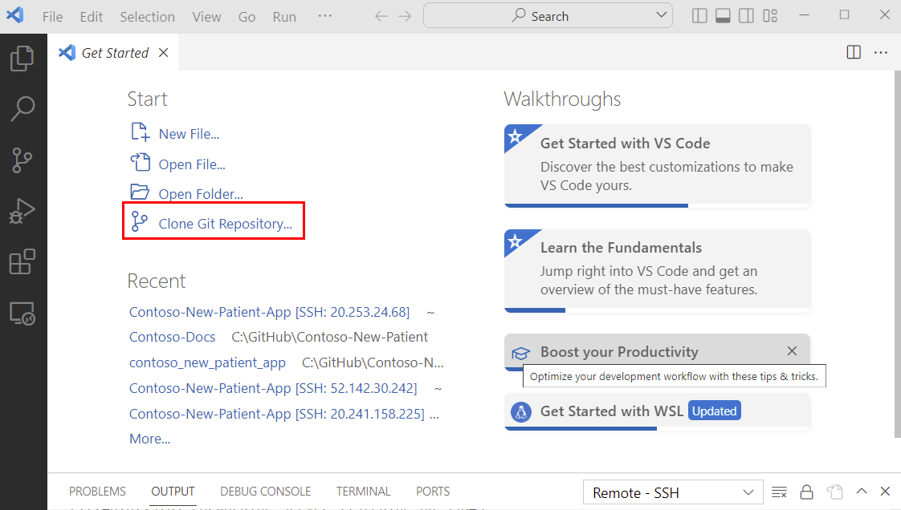
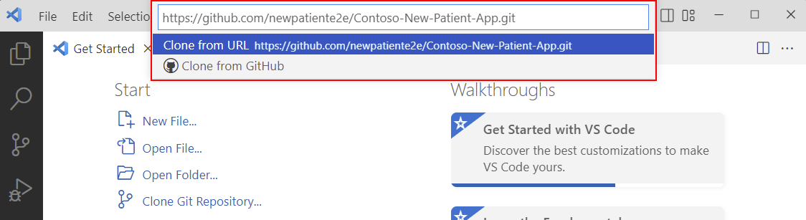

# Azure Container Instance

If you can't use GitHub Codespaces or run Docker on your machine, you can use a [Developer Container Instance](https://azure.microsoft.com/products/container-instances?WT.mc_id=aiml-77396-cxa) to use for the workshop. We'll be connecting to the container instance using VS Code Remote SSH.

## Install the development tools

1. Install [Visual Studio Code](https://code.visualstudio.com/?WT.mc_id=aiml-77396-cxa).

    :::tip

    For chromebooks, review [learning with VS Code on Chromebooks](https://code.visualstudio.com/blogs/2020/12/03/chromebook-get-started?WT.mc_id=aiml-77396-cxa)

    :::

## Sign in to Azure and start the Azure Cloud Shell

1. Sign in to the [Azure portal](https://portal.azure.com/?WT.mc_id=aiml-77396-cxa) using your Azure account.
1. Start the Azure Cloud Shell by clicking the **Cloud Shell** button in the Azure portal.
    
1. You may be prompted to create a storage account. If so, select **Create storage**.

You will be presented with a bash terminal window in the Azure portal.


## Create an Azure resource group

1. Create a resource group using your preferred location. The following example creates a resource group named `rg-globalai` in the `eastus` location.

    ```bash
    az group create --name rg-globalai --location eastus
    ```

    :::tip

    List the Azure locations by running the following command:

    ```bash
    az account list-locations --output table
    ```

    :::

## Create an Developer Container Instance

Next, create a developer Azure Container Instance (ACI) that will host the development environment for the workshop.

The command will take approximately 2 minutes to complete and will return the IP address of the container instance. You will use this IP address to connect to the container instance using VS Code Remote SSH. Be sure to copy the IP address.

```bash
az container create -g rg-globalai --name newpatient --image ghcr.io/newpatiente2e/contoso-new-patient-app:main --cpu 1 --memory 1.5 --ports 22 --protocol tcp --ip-address public --os-type linux --output jsonc --query "ipAddress.ip"
```

:::warning

The container instance costs approximately $US35 per month (as at Oct 2022). Be sure to follow the instructions to [delete the container instance](../45-clean-up.md) when you are done with the workshop.

:::

### Test the connection to the container

From the Azure Cloud Shell, run the following command to test the connection to the container. The password is `back2gether`. Type `exit` to close the SSH session.

```bash
ssh globalai@xx.xxx.xx.xx
```

### Connect to the container using VS Code Remote SSH

1. Open VS Code.
1. Install the [Remote - SSH](https://marketplace.visualstudio.com/items?itemName=ms-vscode-remote.remote-ssh) extension.
1. Select **Remote-SSH: Connect to Host** from the Command Palette (Ctrl+Shift+P).
1. Enter the globalai@xx.xxx.xx.xx the container instance. The password is `back2gether`.
1. Select **Linux** when prompted for the operating system.
1. Select **Continue** to verify the fingerprint.
1. Enter the password for the container instance. The password is `back2gether`.
1. Select **Don't show again** to disable the warning about the operating system.

### Clone the workshop repository

1. Select **Clone Git Repository**.

    

1. Enter the following URL:

    ```text
    https://github.com/newpatiente2e/Contoso-New-Patient-App.git
    ```

    

1. Choose a folder to clone the repository in to. Select the default folder, `/home/ubuntu/`.
1. Select **OK** to clone the repository.
1. You will be prompted to open the cloned repository. Select **Open**.
1. You will be prompted for the password. Enter `back2gether`.
1. Select **Trust the authors of the files**.
1. Next, select **Yes, I trust the authors**.
1. A number of notifications will appear.
    1. Select **Don't Show Again** to disable **Reopen in Container**.
    1. Select **Install** for **Install Recommended Extensions**.
    1. Close the remaining notifications.
1. Select **Restore** to restore the app dependencies. Note, it may take approximately 20 seconds for the **Restore** notification to appear.
1. Select the **Explorer** view from the VS Code **Activity Bar**.
1. **DON'T** close VS Code, as you'll need it open for the rest of the workshop.

Congratulations! You have successfully created a developer container instance and connected to it utilizing VS Code Remote SSH.
