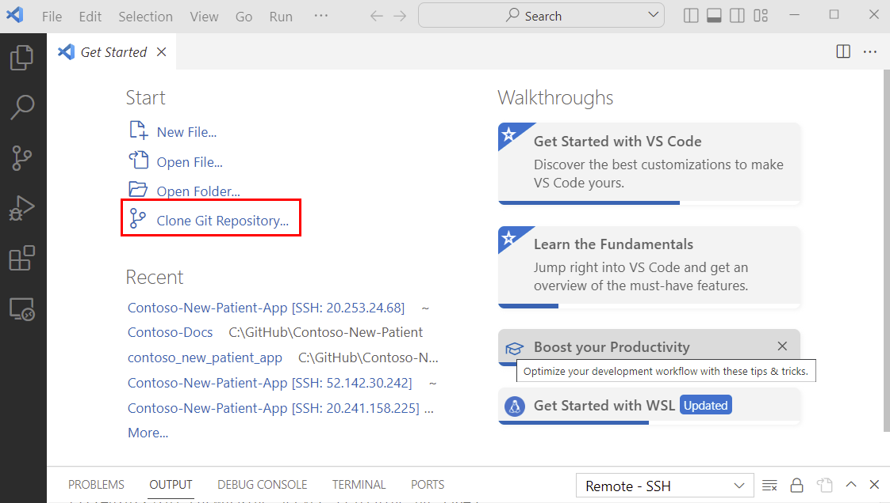
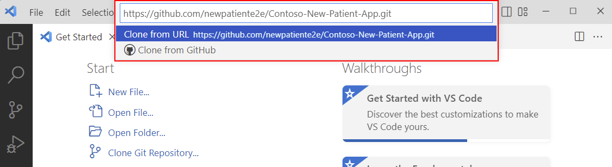

# Local installation

tbc

If you choose not to use a Container Instance or run Docker locally, then you can install the prerequisites on your local machine, then ensure you install the following apps on your computer:

1. [VS Code](https://code.visualstudio.com/?WT.mc_id=aiml-77396-cxa)

1. The C# extension for VS Code. You can install the extension from the [VS Code Marketplace](https://marketplace.visualstudio.com/items?itemName=ms-dotnettools.csharp&WT.mc_id=aiml-77396-cxa).
1. The [git](https://git-scm.com/) client.

1. The [GitHub CLI](https://github.com/cli/cli).

1. The [Azure CLI](https://learn.microsoft.com/cli/azure/install-azure-cli?WT.mc_id=aiml-77396-cxa).

1. The [Azure Developer CLI (azd)](https://learn.microsoft.com/azure/developer/azure-developer-cli/install-azd?tabs=baremetal%2Cwindows&WT.mc_id=aiml-77396-cxa).

1. The [.NET SDK 6.0](https://dotnet.microsoft.com/download/dotnet/6.0?WT.mc_id=aiml-77396-cxa).

    For Ubuntu users, the easiest way to install the .NET SDK is to use the package manager:

    ```bash
    sudo apt update && sudo apt install dotnet-sdk-6.0
    ```

1. [Install the current LTS version of Node.js](https://nodejs.org/).

    For Ubuntu users, follow the instructions on the [Node.js website](https://nodejs.org/en/download/package-manager/#debian-and-ubuntu-based-linux-distributions).

1. The Static Web App CLI (SWA CLI)

    ```bash
    npm install -g @azure/static-web-apps-cli
    ```

## Clone the workshop repository

1. Open VS Code.
1. Install the [Dev Containers](https://marketplace.visualstudio.com/items?itemName=ms-vscode-remote.remote-containers&WT.mc_id=aiml-77396-cxa) extension.
1. Select **Clone Git Repository**.

    

1. Enter the following URL:

    ```text
    https://github.com/newpatiente2e/Contoso-New-Patient-App.git
    ```

    

1. Choose a folder to clone the repository in to.
1. Select **OK** to clone the repository.
1. You will be prompted to open the cloned repository. Select **Open**.
1. Select **Install** for **Install Recommended Extensions**.
1. Select **Restore** to restore the app dependencies.
1. If the **Reopen in Container** notification appears, select **Don't Show Again**, then select **Current Folder**.
1. **DON'T** close VS Code, as you'll need it open for the rest of the workshop.

Congratulations! You've successfully installed the workshop prerequisites locally and opened the solution with VS Code.

Next, [create the workshop Azure Services](../../create-azure-services/)
